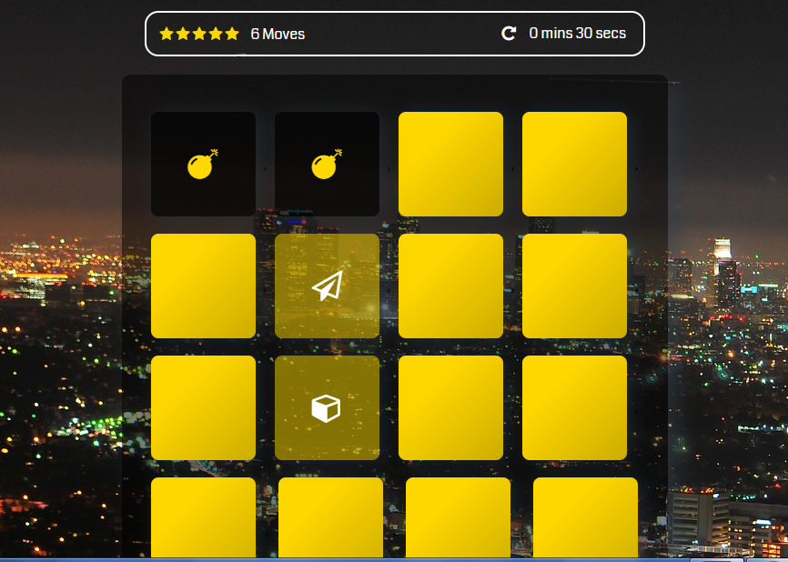
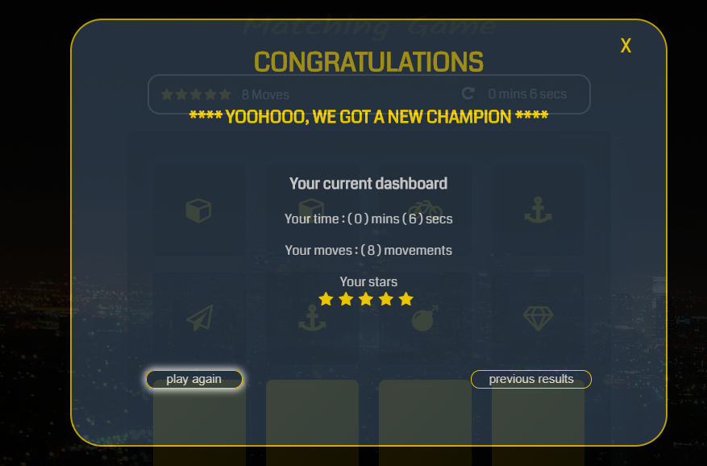
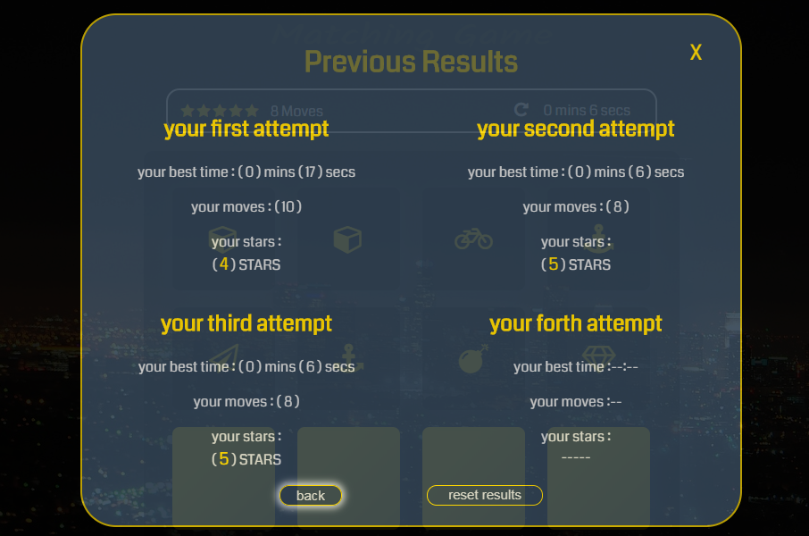

# MEMORY GAME
## Overview:
> *`Full responsive, full keyboard accsseble, and with values stored locally`*
The game board consists of sixteen "cards" arranged in a grid. The deck is made up of eight different pairs of cards, each with different symbols on one side. The cards are arranged randomly on the grid with the symbol face down.
##### the main page
  
 
##### the "current dashboard"
 

##### the "previous results dashboard"
 
## Game Rule:
>The gameplay rule is very simple: flip over two hidden cards at a time to locate the ones that match!

## Instructions :
   - The player flips one card over to reveal its underlying symbol.
   - The player then turns over a second card, trying to find the corresponding card      with the same symbol.
   - If the cards match, both cards stay flipped over.
   - If the cards do not match, both cards are flipped face down

## The Challenge:
>The game ends once all cards have been correctly matched,
but the challenge is to end the game with less time and less moves.

## Additional Features
`1`- you can see your four previous results in the "previous results" dashboard
    because i have used the **_`localStorage`_** `javascript property` to store the
    following info for every turn:
  - The number of star(s) at the end of the game
  - The number of moves at the end of the game
  - The time he/she took to complete the game
   
`2`- This game is fully Accessible by keyboard, you can play it and navigate among 
game cards and navigate over across the main page, `current result` popup dashboard , and `previous results` popup dashboard by using the following:
   - Inside the main page, you can use :
      * `tab` and `shift+tab` for forwarding  &  backwarding navigating. 
      *  when you reach the game board you can use `up`, `down`, `right`, and `left` arrow buttons in addition to `tab` and `shift+tab`.
      *  `enter` or `space` to flip the card.
   - And at the popup dashboards you can use `tab` , `tab+shift`, `arrow buttons`
        to navigate among interactive elements, and `enter` or `space` to activate the functionality which related to it.

`3`- And finally, it is `fully responsive` with all different device sizes ,beginning from `360 px` screen width as a lowest screen width
## Expected question:
 Why did you store only 4 results ?
> Because I found that is enough to show that the results of this game can be stored locally and permanently on the local machine, and if you want i can alter the js code for you to store an infinite numbers of the previous results 

## Support
> If you like this repo and find it useful, please consider (★) starring it, so that it can reach a broader audience.